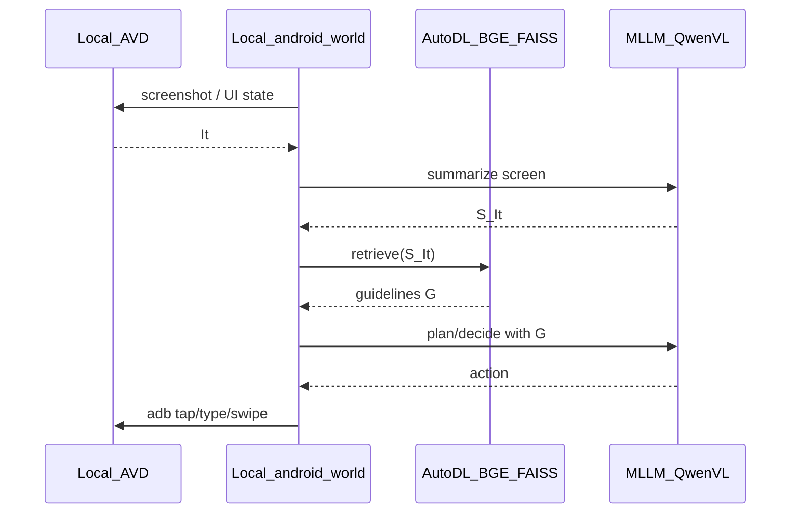

# AutoDL 与本地 AVD 协同方案（PG-Agent）

> 说明：你本机的 `PG-Agent_rest.txt` / `PG-Agent_preview.txt` 当前无法从 AutoDL 读取；以下依据公开论文 [PG-Agent: An Agent Powered by Page Graph](https://arxiv.org/html/2509.03536) 与 AutoDL SSH 隧道文档。

## 论文里的数据流（需要拆开部署的部分）

每一步大致是：



- **必须贴近模拟器**：截图、ADB 执行动作（延迟敏感，流量大）→ 留在**本地**。
- **适合放 GPU**：BGE-M3 向量化 + FAISS 检索（你已在 AutoDL）→ 做成**远程服务**。
- **MLLM（Qwen2.5-VL）**：论文主模型；若本机无卡可再迁到 AutoDL；本方案默认编排在本机，MLLM 可先用 API，后续再迁。

**选定架构：本机编排 + AutoDL 只提供检索 API**（不把 ADB 反代到云端，避免截图反复穿公网、ADB 隧道易断）。

## 角色划分

| 位置 | 职责 |
|------|------|
| 本地 Windows | AVD、ADB、`android_world` 环境步进；调用远程 `/retrieve`；执行动作 |
| AutoDL | 加载 Page Graph + BGE-M3 + FAISS；提供 HTTP `POST /retrieve` |

## 通信方式（选定：SSH 本地转发）

AutoDL 实例无独立公网 IP、个人账号不宜随便开端口。用官方推荐的 **SSH `-L` 隧道**：本机访问 `127.0.0.1:18180` 即打到 AutoDL 上的检索服务。

1. **AutoDL**：启动 FastAPI，监听 `0.0.0.0:6006`（或任意端口）。
2. **本机**（把地址/端口换成控制台里的 SSH 信息）：

```bash
ssh -CNg -L 18180:127.0.0.1:6006 root@<region>.autodl.com -p <ssh_port>
```

3. 本机 agent 配置：`RAG_URL=http://127.0.0.1:18180`。

备选（同机多人调试）：控制台「自定义服务」映射实例 `6006`，本机直接请求生成的 `https://xxx.seetacloud.com:8443`；仍要求服务监听 `0.0.0.0`。

不采用：`ssh -R` 把本机 ADB `5037` 映到 AutoDL 再在云端跑整条 agent——ADB/截图跨网延迟高、隧道掉线难排障。

## AutoDL 侧：检索服务最小接口

在 AutoDL 用 FastAPI（或 Flask）包一层你已部署的 BGE-M3 + FAISS，对齐论文式 (9)(10)(11)(12)：

- `GET /health` → 存活检查  
- `POST /retrieve`  
  - 入参：`{"summary": "<S_It 文本>", "top_k": 4, "bfs_layers": 3, "max_guidelines": 20}`  
  - 出参：`{"guidelines": [{"actions": [...], "tasks": [...]}, ...]}`  
- （建图阶段可选）`POST /embed`：仅返回向量，供离线构图/调试  

服务内流程：`summary → BGE-M3.encode → FAISS.search → 取节点出边 → BFS(l) → 组装 guidelines`。Page Graph 与 FAISS 索引放在 `/root/autodl-tmp` 或 `/root/autodl-fs`。

## 本机侧：android_world 接入点

在本地 agent 循环里，在「屏幕摘要得到 `S_It` 之后、子任务规划之前」插入一次 HTTP 调用，例如：

```python
import requests
r = requests.post(
    "http://127.0.0.1:18180/retrieve",
    json={"summary": screen_summary, "top_k": 4, "bfs_layers": 3},
    timeout=30,
)
guidelines = r.json()["guidelines"]
# 注入 Sub-Task Planning / Decision 的 prompt
```

本地只负责：`env.get_state()` →（本机或远程）MLLM 摘要/决策 → `env.execute_action()`；**不**在 AutoDL 上连 AVD。

## 联调检查清单

1. AutoDL：`curl http://127.0.0.1:6006/health` 成功。  
2. 本机隧道建立后：`curl http://127.0.0.1:18180/health` 成功。  
3. 用固定一句 screen summary 调 `/retrieve`，确认返回非空 guidelines。  
4. 再跑一条 android_world 短任务，确认「截图→摘要→检索→动作→ADB」闭环。

## 后续可扩展（不在本次必做）

- 把 Qwen2.5-VL 也放到 AutoDL，同样用 `-L` 暴露推理端口；本机只传截图/文本。  
- 建图流水线（page jump / node merge）也可在 AutoDL 跑离线任务；在线推理仍走 `/retrieve`。
